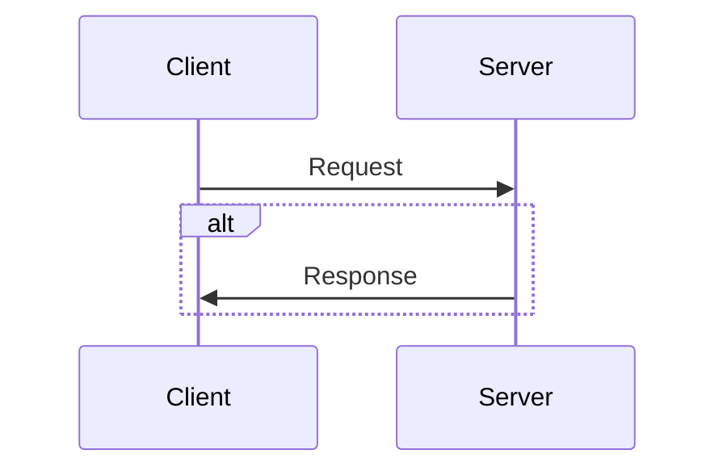

# Build my own Redis step by step

## Client-Server Background



## TCP/IP Model

```
top
  /\    | App |     message or whatever
  ||    | TCP |     byte stream
  ||    | IP  |     packets
  ||    | ... |
bottom
```

- ip packet = sender's adress + receiver's adress + data
- tcp listen on a particular adress and port
