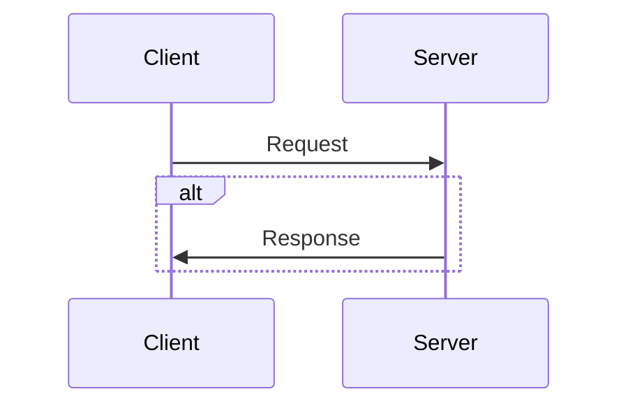

# Build my own Redis step by step

## Client-Server Background



## TCP/IP Model

```
top
  /\    | App |     message or whatever
  ||    | TCP |     byte stream
  ||    | IP  |     packets
  ||    | ... |
bottom
```

- ip packet = sender's adress + receiver's adress + data
- tcp listen on a particular adress and port

## Protocol Parsing

- we need to implement a sort of protocol to let client & server agree with it
- example

```
+-----+------+-----+------+--------
| len | msg1 | len | msg2 | more...
+-----+------+-----+------+--------
```

- the protocol have the following parts: a 4-byte little-endian integer indicating the length of the request, and the variable-length request
- TCP read/write syscalls can return less than number of bytes you specified to read or write

## The Event Loop & Nonblocking I/O

- 03 three ways to deal with concurrent connection: spin up new thread, spin up a new process and perform non blocking IO
- with non blocking, we get get the ready fide descriptors and do the corresponding work
- in non blocking mode, calls like accept() read() write() return EAGAIN (not ready) instead of blocking
- to set a file descriptor non blocking, we use the fcntl() syscall
- use the poll() systel call to perform non blocking IO on file descriptors
