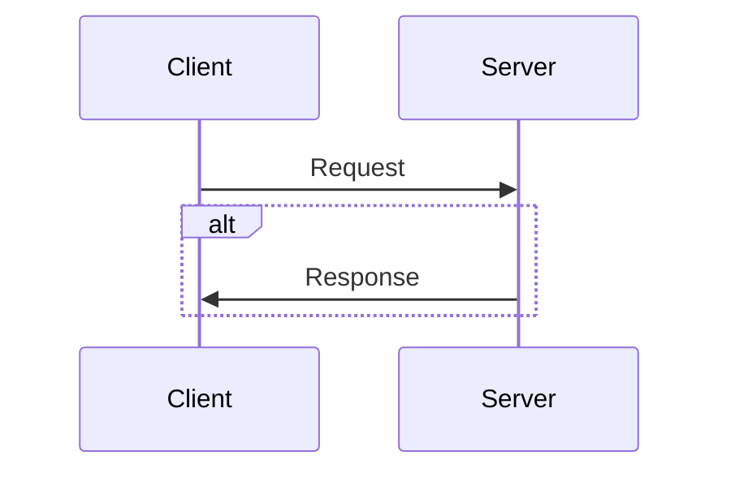

# Build my own Redis step by step

## Client-Server Background



## TCP/IP Model

```
top
  /\    | App |     message or whatever
  ||    | TCP |     byte stream
  ||    | IP  |     packets
  ||    | ... |
bottom
```

- ip packet = sender's adress + receiver's adress + data
- tcp listen on a particular adress and port

## Protocol Parsing

- we need to implement a sort of protocol to let client & server agree with it
- example

```
+-----+------+-----+------+--------
| len | msg1 | len | msg2 | more...
+-----+------+-----+------+--------
```

- the protocol have the following parts: a 4-byte little-endian integer indicating the length of the request, and the variable-length request
- TCP read/write syscalls can return less than number of bytes you specified to read or write

## The Event Loop & Nonblocking I/O

- 03 three ways to deal with concurrent connections: spin up new thread, spin up a new process and perform non blocking IO
- with non blocking, we get get the ready to use file descriptors and do the corresponding work
- in non blocking mode, calls like accept() read() write() return error EAGAIN (not ready) instead of blocking
- to set a file descriptor non blocking, we use the fcntl() syscall
- use the poll() system call to perform non blocking IO on file descriptors

## Basic Server Cmd

- the protocol describing the command format

```
+------+-----+------+-----+------+-----+-----+------+
| nstr | len | str1 | len | str2 | ... | len | strn |
+------+-----+------+-----+------+-----+-----+------+
```

- nstr is the number of strings in the command, len is the length of the following string
- the response is

```
+----------+---------+
| res_code | data... |
+----------+---------+
```

- res_code is a 32 bit integer giving the status of the response

## Data Structure: Hashtables

- lookup in constant runtime O(1)
- two types of hashtables: open adressing & chaining
- open adressing is more CPU cache friendly

## Data Serialization & Deserialization

- Find a general way to handle multiple data types
- We use TLV binary format: Type-Length-Value
- Type is an enum of integers and is encoded as 1byte, length is 4 bytes and value have variable length

## AVL TREES

- Sorted set is a collection of pair (score,name) indexed in 2 ways:
  - Find score by name
  - Get a subset of sorted pairs
    - Seek to the closest pair from a tzrget
    - Iterate from ascending or descending order to the starting point
- Rank queries
  - Get a pair's rank
  - Get a pair by its rank
- Trees are hierarchical and recursive.A node tree divides the dataset into non-overlaping subtrees that is how data is sorted
- AVL Tree are binary trees with extra steps: the heignt difference between right and left node is at most 1
- Rotations are used to keep order

## Build Client & Server binary

```
g++ -Wall -Wextra -O2 -g server.cpp -g hashtable.cpp -o server.out

g++ -Wall -Wextra -O2 -g client.cpp -o client.out
```

## Basic commands

```
# Run the server
./server.out

# Client basics commands
client.out set x y
client.out get x => output y
client.out del x
```
