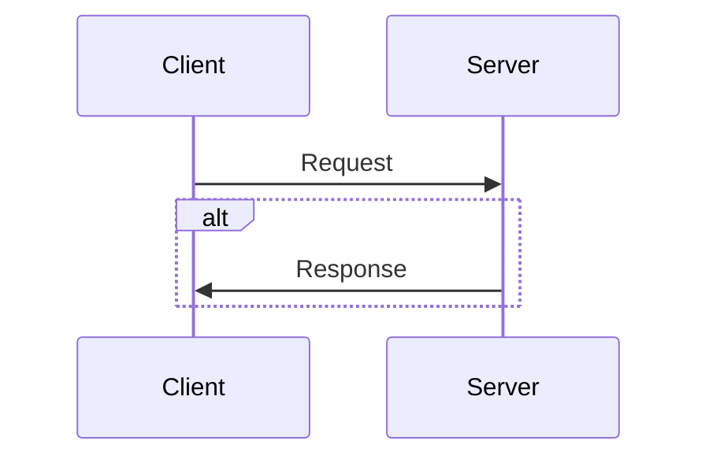

# Source

- Beej's Network Programming: https://beej.us/guide/bgnet/html/

# Notes

## Sockets

- socket is a way programs can communicate by using file descriptors (fd)
- fd are integers representing an opened file
- we can set up file descriptors using the socket() system call
- we send infos with send() and recv()
- 2 types of internet sockets: "Stream Sockets" and "Datagram Sockets"
- 2 types of internet sockets: SOCK_STREAM and SOCK_DGRAM
- stream sockets use TCP and datagram sockets use UDP
- UDP opposite to TCP is unreliable

## IP Adresses

- IPV4, 4 bytes, 0 to 255, 192.234.1.76
- we quickly ran about of thems but remedy this by using NAT (Network Adress Translation)
- so IPV6, 16 bytes was born and offer 79 MILLION BILLION TRILLION
- ipv6 loopback adresse is "::1"

### PORT Numbers

- 16 bit number as local adress of the connection
- if IP adresses are adresses for a home, the port number is like the number of a room in thos house
- ports number under 1024 are considered special and require OS permission to be use

## Structs

- a socket file descriptor is just an integer
- the addrinfo have the following structure

```
struct addrinfo {
    int              ai_flags;     // AI_PASSIVE, AI_CANONNAME, etc.
    int              ai_family;    // AF_INET, AF_INET6, AF_UNSPEC
    int              ai_socktype;  // SOCK_STREAM, SOCK_DGRAM
    int              ai_protocol;  // use 0 for "any"
    size_t           ai_addrlen;   // size of ai_addr in bytes
    struct sockaddr *ai_addr;      // struct sockaddr_in or _in6
    char            *ai_canonname; // full canonical hostname

    struct addrinfo *ai_next;      // linked list, next node
};

```

- the socket adress info for ipv4 looks like that: AF_INET

```
struct sockaddr_in {
    short int          sin_family;  // Address family, AF_INET
    unsigned short int sin_port;    // Port number
    struct in_addr     sin_addr;    // Internet address
    unsigned char      sin_zero[8]; // Same size as struct sockaddr
};

struct in_addr {
    uint32_t s_addr; // that's a 32-bit int (4 bytes)
};

```

- the socket adress info for ipv6 looks like that: AF_INET6

```
struct sockaddr_in6 {
    u_int16_t       sin6_family;   // address family, AF_INET6
    u_int16_t       sin6_port;     // port number, Network Byte Order
    u_int32_t       sin6_flowinfo; // IPv6 flow information
    struct in6_addr sin6_addr;     // IPv6 address
    u_int32_t       sin6_scope_id; // Scope ID
};

struct in6_addr {
    unsigned char   s6_addr[16];   // IPv6 address
};

```

- there is a structure that can hold informations about both ipv4 & ipv6: sockaddr_storage

```
struct sockaddr_storage {
    sa_family_t  ss_family;     // address family

    // all this is padding, implementation specific, ignore it:
    char      __ss_pad1[_SS_PAD1SIZE];
    int64_t   __ss_align;
    char      __ss_pad2[_SS_PAD2SIZE];
};

```

- we can convert an ipv4 or ipv6 adress respectively to sin_addr and sin6_addr by using this function : inet_pton()

```
struct sockaddr_in sa; // IPv4
struct sockaddr_in6 sa6; // IPv6

inet_pton(AF_INET, "10.12.110.57", &(sa.sin_addr)); // IPv4
inet_pton(AF_INET6, "2001:db8:63b3:1::3490", &(sa6.sin6_addr)); // IPv6

```

## System Calls

- fonctions calls, the kernel takes care of that

### getaddrinfo()

- used to perform DNS lookup and fill the result in the "struct addrinfo"
- definition

```
int getaddrinfo(const char *node,     // e.g. "www.example.com" or IP
                const char *service,  // e.g. "http" or port number
                const struct addrinfo *hints,
                struct addrinfo **res);

```

### socket()

- used to get file descriptor
- definition

```
int socket(int domain, int type, int protocol);

```

### bind()

- associate the created socket file descriptor with an IP and PORT number
- definition

```
int bind(int sockfd, struct sockaddr *my_addr, int addrlen);

```

### connect()

- used by the client to conect to a specific host on a specific port
- definition

```
int connect(int sockfd, struct sockaddr *serv_addr, int addrlen);

```

### listen()

- used by the server to handle incoming connections from client
- definition

```
int listen(int sockfd, int backlog);
```

### accept()

- used by the server accept a new connection froom client, this return a new file descriptor for this specific connection with client
- definition

```
int accept(int sockfd, struct sockaddr *addr, socklen_t *addrlen);

```

### send() & recv()

- used by the server or client to communicate via a stream socket
- definition

```
int send(int sockfd, const void *msg, int len, int flags);

int recv(int sockfd, void *buf, int len, int flags);

```

- from the server perspective, these are the system calls to get file descriptor and communicate with client:

```
getaddrinfo();
socket();
bind();
listen();
accept();
```

- from the client perspective, these are the system calls to get file descriptor and communicate with server:

```
getaddrinfo();
socket();
connect();
```

### sendto() & recvfrom()

- used by the server or client to communicate via a datagram socket
- since datagram sockets use UDP and UDP is connectionless, when we want to send UDP datagram, we need to specify the destination IP and PORT with a strcture: sockaddr_in, or sockaddr_in6
- definition

```
int sendto(int sockfd, const void *msg, int len, unsigned int flags, const struct sockaddr *to, socklen_t tolen);
int recvfrom(int sockfd, void *buf, int len, unsigned int flags, struct sockaddr *from, int *fromlen);

```

- from the server perspective, these are the system calls to get file descriptor and communicate with client:

```
getaddrinfo();
socket();
bind();
listen();
accept();

```

- from the client perspective, these are the system calls to get file descriptor and communicate with server:

```
getaddrinfo();
socket();
connect();

```

### close() and shutdown()

- close is use to close the connection, so that recv() and send() are not allowed, it takes the socket file descriptor
- shutdown also allow to change the socket file descriptor usability not close it, so we specify the socket file descriptor and the way we want to change the socket usage

```
close(sockfd);
int shutdown(int sockfd, int how);

```

### getpeername()

- get informations about the other side, ip adress and port

```
int getpeername(int sockfd, struct sockaddr *addr, int *addrlen);

```

### gethostname()

- get the name of the local machine on which our program is running

```
int gethostname(char *hostname, size_t size);

```

## Client-Server Background



## Advanced Techniques

### Blocking

- some system class like accept() or recv() blocks when there is no connection in backlog queue or no data to receive
- we can make the socket non-blocking by using fcntl()

```
sockfd = socket(PF_INET, SOCK_STREAM, 0);
fcntl(sockfd, F_SETFL, O_NONBLOCK);

```

- when we call for example recv() and there is no data, the call won't block but it will return -1 and errno will be set to EWOULDBLOCK or EAGAIN

### Synchronous I/O multiplexing

- we have to monitor a bunches of sockets and handles the ones that have data ready
- so to avoid polling, we use the poll() syscall, we the kernel let us know when data is ready on a specific socket
- the poll() syscall takes an array of socket file descriptors that we want to monitor
